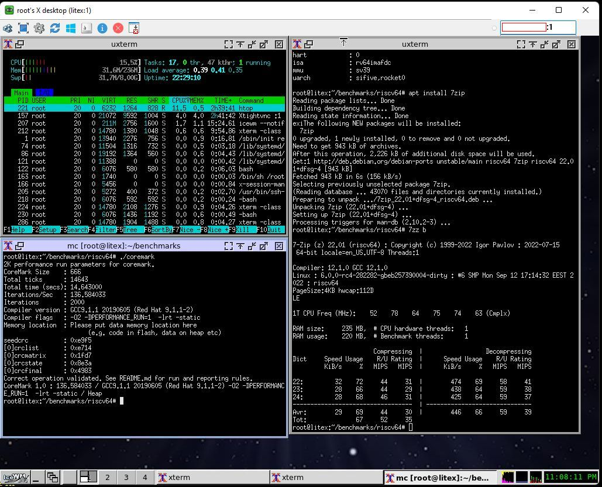
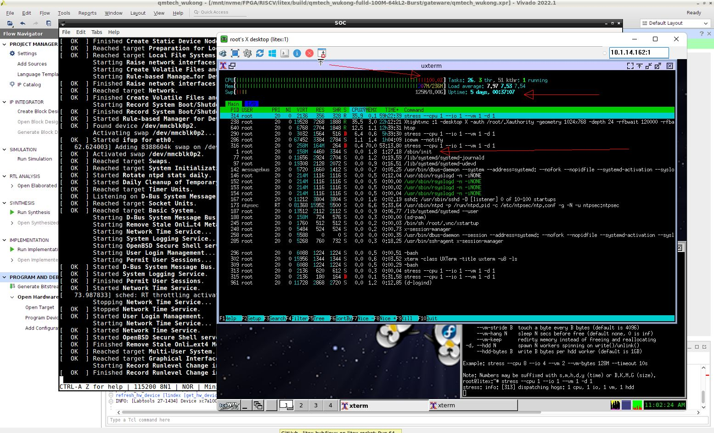
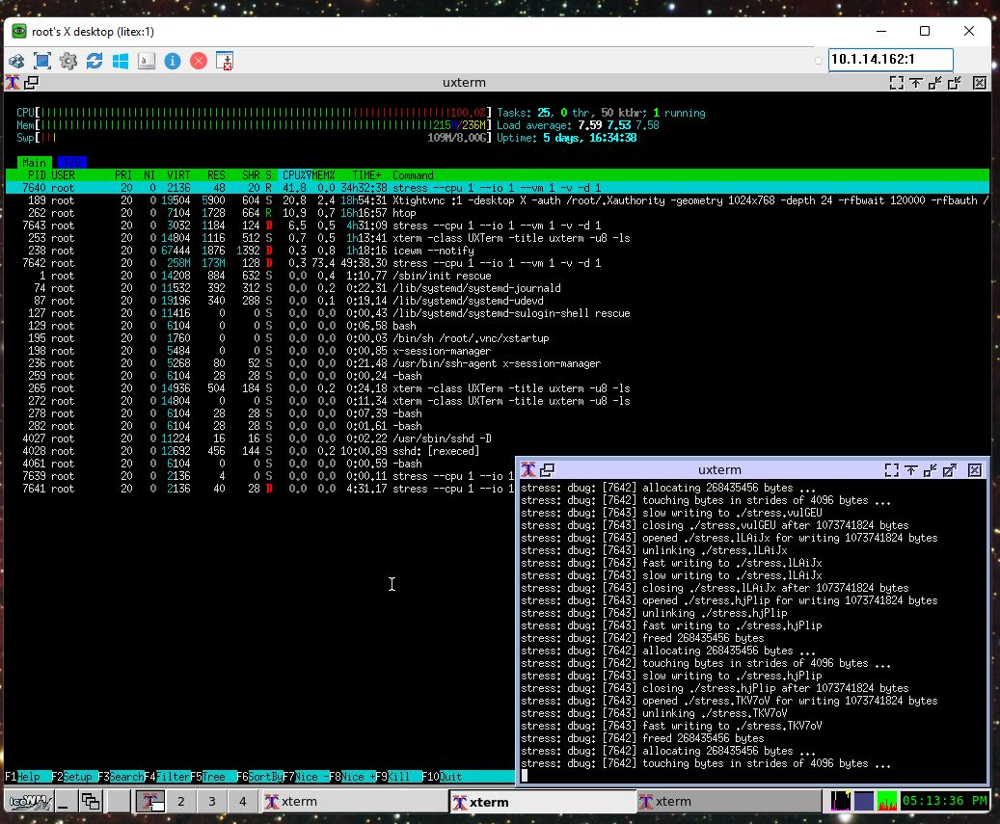

# qmtech_wukong_debian_on_litex_rocket
Running RISCV64 Debian on Litex/Rocket with a qmtech wukong FPGA 
Inspired from https://github.com/tongchen126/Boot-Debian-On-Litex-Rocket , with a lot of advices (and many thanks) from Gabriel L. Somlo

I managed to run a -pretty much- stable RISCV64 Debian with Qmtech's Wukong board (version 2) and Litex/Rocket.

As a development environment I used Debian 11 "bullseye" with backports. The steps I followed are (beware, YMMV) :

1) I Installed Linux on Litex Rocket (https://github.com/litex-hub/linux-on-litex-rocket) and followed the steps 1-4 in "Prerequisites" to install litex.
NOTE DO NOT SKIP step 3 if you do not have an already proved toolchain. Debian's toolchain also gave me a lot of headaches. It takes some time to build it but you will not regret it ! 

2) At "Building the Gateware (FPGA Bitstream) -> NOTE 1", following this advice from Gabriel, https://github.com/litex-hub/linux-on-litex-rocket/issues/10#issuecomment-1249245531, the bit width of the point-to-point AXI link connecting the CPU and LiteDRAM controller is 128, so I need a fulld variant.

3) (Optional) I configured litex to include all the cpu variants that I needed and were missing, eg linux4d or full2d

```
      cd pythondata-cpu-rocket/pythondata_cpu_rocket/verilog
      vi update.sh   copy-paste and change accordingly, adding the variant you need
      ./update.sh (will take some time)
      vi litex/litex/soc/cores/cpu/rocket/core.py  add accordingly the variant you need
```
4) I use Vivado. Notes on "Building the Gateware (FPGA Bitstream)".

	NOTE 1 : I found that adding bigger L2 cache improves the stability of the SOC. I finally used 65536.
	NOTE 2 :  I tried two cases: linux4d (4 cores without FPU) and fulld (1 core with FPU). linux4d seems pretty slow and unstable so I used fulld which is faster and pretty stable. Unfortunatelly I'm not able to synthesize a full2d cpu, as tongchen126 mentioned, because it requires more SLUTS than the available.
	NOTE 3 : I used 100MHz as clock frequency.
	NOTE 4 : Special attention, which board version you have, mine is version 2.
	NOTE 5 : --bus-bursting seems to improve the performance by 30%
	NOTE 6 : board's urat to serial supports baud rate 3000000, handy for loading firmware over serial

I included ethernet, video terminal and an sdcard.  The command I used were :

```  
  litex-boards/litex_boards/targets/qmtech_wukong.py --build --with-ethernet  --with-sdcard --with-video-terminal \
             --cpu-type rocket  --cpu-variant fulld --l2-size 65536 --sys-clk-freq 100e6  --board-version 2 --bus-bursting  \
	     --csr-csv  qmtech_wukon-rocket.csv --csr-json qmtech_wukong-rocket.json --uart-baudrate 3000000 \
	     >  qmtech_wukong-rocket.log 2>&1 &
```

5) **With the new commits, this step has been very easy.** Just run :
```
   litex_json2dts_linux --root-device mmcblk0p3 qmtech_wukong-rocket.json > qmtech_wukong_fulld-100M.dts
```

~~I used the provided nexys4ddr_fpu.dts as prototype to make the corresponding file for the board. The main difference is the 256MB (vs 128MB) DRAM chip and the clock. The file qmtech_wukon-rocket.csv and qmtech_wukong-rocket.json are very useufull to confirm that the DTS is correct.~~

6) Also I modified the linux boot line. I boot without an initrd, directly from the SDcard. I have 3 partitions:  sda1 (mmcblck0p1) with VFAT for booting (where boot.bin is placed), sda2 (mmcblck0p2) as a 8GB swap, and sda3 (mmcblck0p3) as ext4 root filesystem.

7) In "Building the Software", skip steps 1 and 2 (building of busybox and initramfs.cpio). It boots straight with Debian's systemd on the sdcard. BTW, if you ever need busybox, the staticaly linked provided by Debian works fine.

8) In step 3 (Building the Kernel), run the first make without initramfs.config:
```
		make ARCH=riscv CROSS_COMPILE=riscv64-unknown-linux-gnu- \
			litex_rocket_defconfig 
```

and after edit the resulting .config , search for CONFIG_RISCV_SBI_V01 and change it to 
```
	CONFIG_RISCV_SBI_V01=y
```

before you compile the kernel.
	NOTE 2023-01-30  the new liteuart driver with irq support is not working properly for me. As soon as the driver registers the IRQ to the controller,
	                 the system crawls to it's knees, and never boots. If I delete the "interrupts" line for liteuart in DTS, the system boots and
			 getty on liteuart is pretty stable, but then ethernet is not working (says it is ok but nothing happens). As a workaround I used a
			 quick&dirty trick, I I hardcoded "port->irq = 0"; at the top of liteuart_startup, so to force the driver to use timer_setup instead.
			 This way both liteuart and liteeth are happy. 
	2023-03-10: another way is to use sbi/hvc0 , see at https://github.com/roryt12/qmtech_wukong_debian_on_litex_naxriscv

9) Build BBL with the correct DTS file. Copy the resulting boot.bin in the first (VFAT) partition of the SDcard

10) Created a chroot Debian environment with the instructions from https://wiki.debian.org/RISC-V, step 6, "Creating a riscv64 chroot", with debootstrap. 
```
	sudo apt-get install debootstrap qemu-user-static binfmt-support debian-ports-archive-keyring
	sudo debootstrap --arch=riscv64 --keyring /usr/share/keyrings/debian-ports-archive-keyring.gpg --include=debian-ports-archive-keyring unstable /tmp/riscv64-chroot http://deb.debian.org/debian-ports
```

and run after the steps in "Preparing the chroot for use in a virtual machine". The steps for u-boot are not really needed (for the moment at least). I modified a few other things in the chroot environment, eg  installed udev, locales / timezone (as mentioned from tongchen126) and a few others. A few additional things needed to be edited, eg hostname, hosts, network/interfaces, fstab etc. In my case, systemd worked better that sysvinit. I'm not even getting the RCU warnings. If needed, they can be disabled from kernel's boot arguments with 
```
      rcupdate.rcu_cpu_stall_suppress=1
```   

In systemd's journald.conf, I used:
```
	Storage=none
```

and in logind.conf:
```
	NAutoVTs=0
	ReserveVT=0
```

and in /etc/login.defs :
```
	LOGIN_TIMEOUT           180
```

After all, this is a very low resources board and it is SLOW!    

Copy your chroot environment to sda3 (mmcblk0p3), put the card in the board, program the bitstream and you are ready to boot to Debian !

Note: I found that a small heatsink improves FPG'a stability. Also placing the board inside the computer room (18 Celsious) helped a lot ;)








